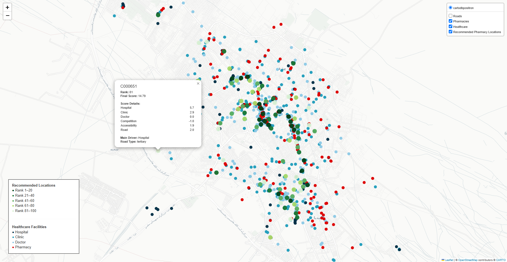

# Pharmacy Location Intelligence
Current Version: v1.0
Status: Stable

# Overview

This project identifies optimal locations for establishing new pharmacies using a GIS-based multi-criteria spatial decision model.

The workflow combines healthcare facilities, road accessibility, competition, and spatial constraints to rank candidate locations across the study area.

The entire scoring model is fully configurable through a JSON configuration file without modifying the Python source code.

## Final Output



## Quick Start (View Results Only)
If you only want to explore the final results, you only need the following folders:

```text
outputs/
    best_locations_map.html

data/processed/
    best_areas.geojson
    best_areas.xlsx
```

Simply open:

```text
outputs/best_locations_map.html
```

in any modern web browser.

No Python installation is required.


## For Developers
To reproduce the complete analysis:

```text
python scripts/run_phase1.py
python scripts/run_phase2.py
```

Phase 1 prepares spatial datasets.

Phase 2 performs candidate generation, scoring, ranking and visualization.


# Project Structure
config/
    scoring.json               # Model parameters

data/
    raw/                       # Original downloaded datasets
    processed/                 # Intermediate processing outputs

outputs/
    best_locations_map.html    # Final interactive map

scripts/
    run_phase1.py              # Data preparation pipeline
    run_phase2.py              # Analysis pipeline


# Data Sources

The model integrates several spatial datasets:

Healthcare facilities (Google Maps / OpenStreetMap)
Road network (OpenStreetMap)
Urban boundary (generated from road network)
Candidate road points generated from major roads

All processed datasets are stored in:

data/processed/
Workflow

The project consists of two independent pipelines.

Phase 1 — Data Preparation

Purpose:

Download raw spatial datasets
Clean and standardize healthcare facilities
Prepare road network
Generate urban mask

Output:

data/processed/
Phase 2 — Spatial Analysis

Purpose:

Generate candidate road points
Compute multi-criteria scores
Rank candidate locations
Apply spatial spacing constraints
Create the interactive recommendation map

# Final outputs:

outputs/best_locations_map.html

data/processed/best_areas.geojson

data/processed/best_areas.xlsx


# Scoring Configuration

All scoring parameters are defined in:

```
config/scoring.json
```

This file controls the complete multi-criteria scoring model. Changing these values recalibrates the model without modifying the Python source code.

---

# Overall Scoring Logic

Each candidate location is evaluated using four independent components:

- Prescription Potential
- Competition
- Accessibility
- Road Importance

The final score is calculated as:

```
Final Score =
(Prescription × prescription_weight)
− (Competition × competition_weight)
+ (Accessibility × accessibility_weight)
+ (Road Bonus × road_weight)
```

Each component can be weighted independently using the `score_weights` section.

---

# Facility Weights

Healthcare facilities contribute differently to the expected prescription demand.

| Facility | Description |
|-----------|-------------|
| Hospital | Highest demand generator because hospitals usually contain multiple specialties and produce large patient volumes. |
| Clinic | Medium demand generator. Clinics generally aggregate several physicians but usually generate less demand than hospitals. |
| Doctor | Individual physician office. |
| Pharmacy | Negative contribution representing local market competition. |

These values are intentionally relative rather than absolute. Their purpose is to express the expected contribution of one facility type compared with another.

---

# Search Radius

```
search_radius
```

Maximum distance (meters) used to search for nearby healthcare facilities.

Only facilities inside this radius contribute to the score.

Smaller values produce highly local recommendations.

Larger values produce smoother regional trends.

---

# Gaussian Sigma

```
gaussian_sigma
```

Controls how quickly facility influence decreases with distance.

Facility influence follows a Gaussian distance-decay function.

- Small sigma → nearby facilities dominate.
- Large sigma → distant facilities continue to influence the score.

Sigma should normally be smaller than or approximately equal to the search radius.

---

# Competition Radius

```
competition_radius
```

Reserved for future model extensions.

The current version models pharmacy competition through the Gaussian distance-decay function and therefore does not explicitly use this parameter.

---

# Road Bonus

Road hierarchy contributes an accessibility bonus.

Major roads receive larger bonuses because they generally provide:

- higher visibility,
- easier vehicle access,
- greater traffic flow.

Typical hierarchy:

- trunk
- primary
- secondary
- tertiary

Road weights are intentionally modest so that healthcare demand remains the dominant factor in the final score.

---

# Score Weights

The relative importance of each scoring component is controlled independently.

| Parameter | Purpose |
|-----------|---------|
| prescription | Importance of healthcare demand |
| competition | Penalty for nearby pharmacies |
| accessibility | Bonus for concentration of healthcare services |
| road | Accessibility bonus from road hierarchy |

Increasing one weight changes only that component without affecting the underlying data.

---

# Candidate Selection

After every road point receives a score, the final recommendation stage performs spatial filtering.

Two parameters control this process:

```
minimum_distance
```

Minimum allowed distance between selected candidate locations.

Increasing this value produces a more spatially distributed set of recommendations.

```
top_n
```

Maximum number of candidate locations retained after ranking.

---

# Model Philosophy

The model is intentionally simple, transparent, and interpretable.

Rather than relying on a black-box machine learning algorithm, each recommendation is produced from explicit spatial rules based on:

- nearby healthcare demand,
- pharmacy competition,
- road accessibility,
- configurable weighting parameters.

This design allows health planners and decision-makers to understand, reproduce, and calibrate the scoring process for different cities or planning scenarios.

## Key Design Decisions

The model intentionally prioritizes simplicity and interpretability over excessive model complexity.

Current scoring considers four independent components:

- Healthcare demand
- Existing pharmacy competition
- Accessibility
- Road hierarchy

Medical specialties, population density, traffic volume, and socioeconomic indicators were intentionally excluded because consistent and reliable datasets were not available. The modular design allows these variables to be incorporated in future versions without changing the overall architecture.